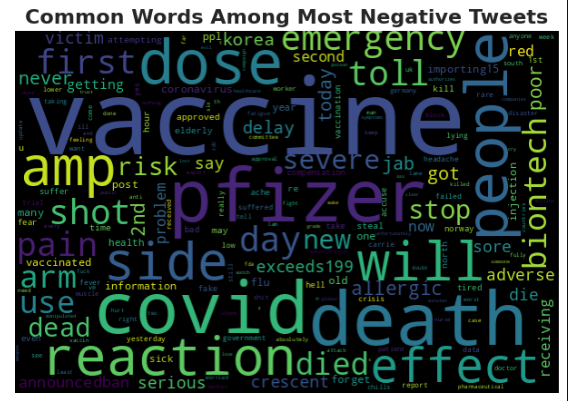
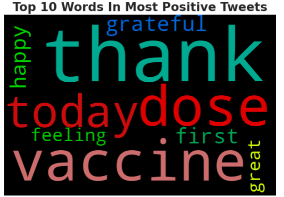
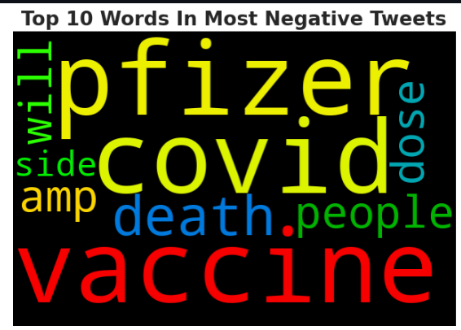
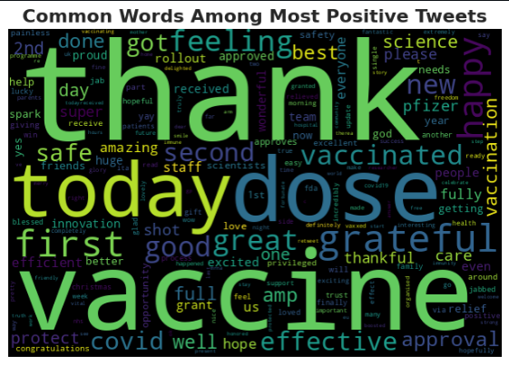

# COVID-19 Data Analysis and Visualization.

This project analyzes global COVID-19 data to uncover trends, visualize pandemic impacts, and generate actionable insights."
## Key Features:

interactive dashboards, predictive models, or data visualizations. E.g., "Includes real-time data dashboards and predictive analytics for trend forecasting."
Technologies Used:

Built using Python, FastAPI, and visualization libraries such as Matplotlib and Seaborn.
Installation and Setup:

Provide instructions for setting up the project. E.g., "Clone the repository, install dependencies via pip install -r requirements.txt, and run python app.py."
Usage:

Navigate the interactive dashboard to view global COVID-19 trends and forecasts.
Data Sources:

Data sourced from the Johns Hopkins University COVID-19 dashboard.
Contributing:

Open to contributions. Please follow the contribution guidelines in CONTRIBUTING.md.
License:

Licensed under MIT License.
Contact Information:

Provide contact details for further queries. E.g., "For question."
Introduction:

